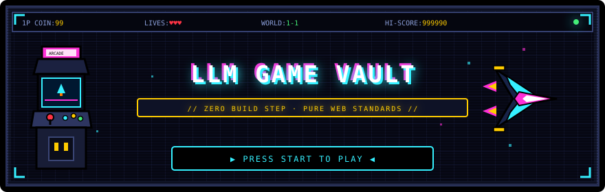
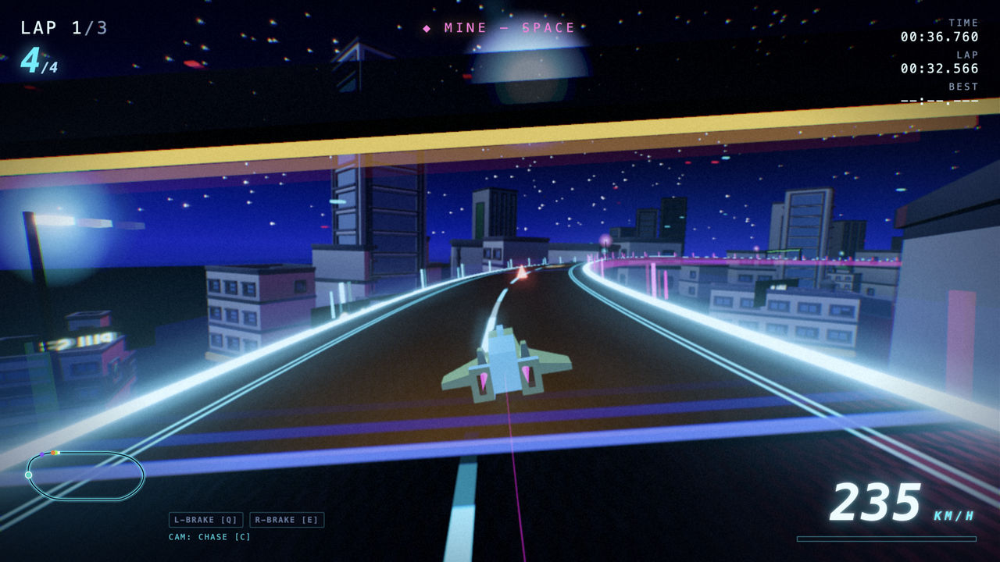
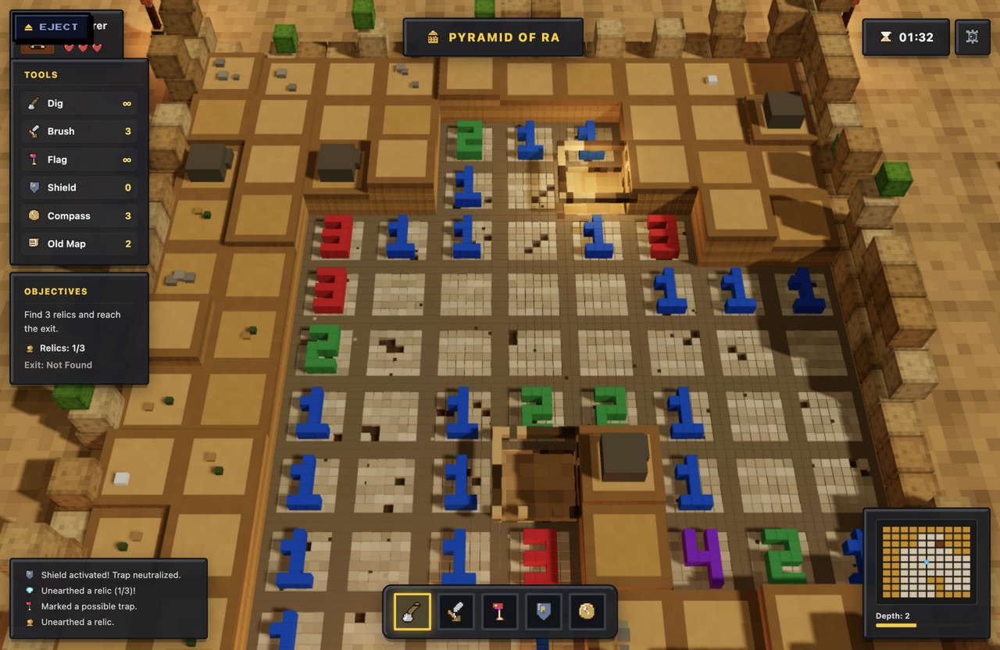
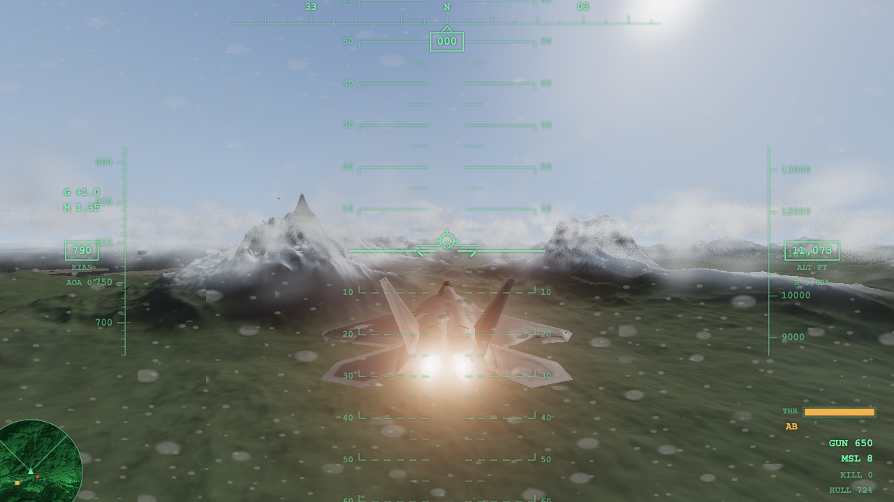
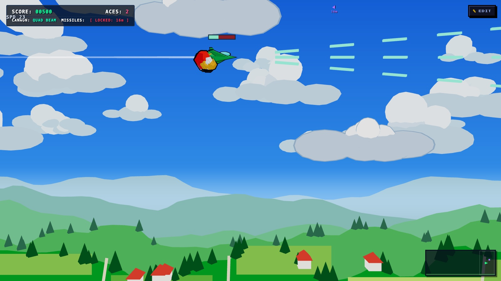
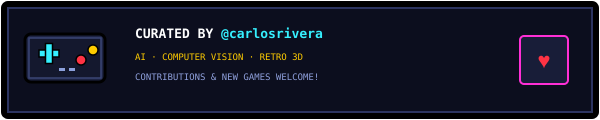

<div align="center">



<br><br>


<br>

</div>


## 🎮 Game Index

| Game | Genre | Players | Play |
| --- | --- | --- | --- |
| **GRAVPULSE 2097** | 3D anti-gravity racer | 1–4 players | [▶ Launch game](https://carlosrivera.github.io/arcade-vault/games/gravpulse/) |
| **DUNESWEEPER** | Voxel archaeological minesweeper | 1 player | [▶ Launch game](https://carlosrivera.github.io/arcade-vault/games/dunesweeper/) |
| **STRIKEVECTOR** | Flight combat | 1 player | [▶ Launch game](https://carlosrivera.github.io/arcade-vault/games/aces/) |
| **SKY STRIKE** | 3D Cel-shaded 2D dogfighter | 1 player | [▶ Launch game](https://carlosrivera.github.io/arcade-vault/games/sky-strike/) |

### ⚡ GRAVPULSE 2097

[](https://carlosrivera.github.io/arcade-vault/games/gravpulse/)

High-speed anti-gravity racing through neon circuits. Bank through corners, deploy shields, fire rockets, and race for pole position.

[**▶ PLAY GRAVPULSE 2097**](https://carlosrivera.github.io/arcade-vault/games/gravpulse/) · [View source](./games/gravpulse/)

### 🏺 DUNESWEEPER

[](https://carlosrivera.github.io/arcade-vault/games/dunesweeper/)

Excavate procedural voxel ruins, dodge scorpions and traps, uncover golden relics, and descend into forgotten desert tombs.

[**▶ PLAY DUNESWEEPER**](https://carlosrivera.github.io/arcade-vault/games/dunesweeper/) · [View source](./games/dunesweeper/)

### ✈️ STRIKEVECTOR

[](https://carlosrivera.github.io/arcade-vault/games/aces/)

Fly an F-22-style fighter with a realistic 6DOF flight model — angle-of-attack lift curve, induced drag, afterburner, G-load, and stalls — over infinite procedural terrain streamed in chunks. Full modern fighter HUD: artificial horizon pitch ladder, heading tape, speed/altitude tapes, flight-path marker, radar, and missile lock. Hunt enemy aces with cannon and seeker missiles.

[**▶ PLAY STRIKEVECTOR**](https://carlosrivera.github.io/arcade-vault/games/aces/) · [View source](./games/aces/)

### 🛩️ SKY STRIKE

[](https://carlosrivera.github.io/arcade-vault/games/sky-strike/)

High-energy 2D arcade dogfights rendered with 3D cel-shaded graphics. Pull acrobatic 360° loops, fire plasma lasers, launch homing micro-missiles with swirling smoke contrails, and dogfight bandit aces over lush anime rolling hills.

[**▶ PLAY SKY STRIKE**](https://carlosrivera.github.io/arcade-vault/games/sky-strike/) · [View source](./games/sky-strike/)


## ⚡ The Philosophy: Zero Build Step, Pure Web Standards

### Why Vanilla JavaScript & Native ES Modules?
1. **Zero Transpilation / Zero Compilation:** The entire repository runs directly in any modern browser without Webpack, Vite, Rollup, Babel, or TypeScript compilation steps.
2. **Instant Feedback & Collaboration:** Anyone—whether an LLM agent or a human developer—can clone the repo, edit a `.js` file, and immediately see the results with a browser refresh (`Cmd+Shift+R`).
3. **Longevity & Retrocompatibility:** By relying on standard web APIs (HTML5, Canvas, WebGL, Web Audio API, native ESM `importmap`), games written today will continue to run seamlessly decades from now without breaking due to obsolete build tools.


## 📁 Repository Architecture

```
/
├── index.html            # 8-bit arcade gallery portal
├── games.json            # Database registry of all available games
├── biome.json            # Lightning-fast linting & formatting configuration
├── package.json          # Node package definition & Biome scripts
├── assets/               # 8-bit SVG artwork, banners, & arcade badges
├── shared/               # Standardized libraries shared across games
│   └── vendor/           # Three.js, postprocessing shaders, math utils
└── games/                # Individual game modules
    └── gravpulse/        # GRAVPULSE 2097: 3D Anti-Grav Racer
        ├── index.html    # Game entry point
        └── src/          # Pure ES module game code
```


## 🚀 Quick Start

Start a local static HTTP server:

```bash
# Python 3
python3 -m http.server 8137

# Or pnpm dlx (serve)
pnpm dlx serve . -p 8137
```

Open `http://localhost:8137/` in your browser.


## ✎ Edit a Game While It Runs (OpenRouter)

Every game page carries an **EDIT** button when it is served from localhost. Describe a change in
plain language and the running game rewrites itself — no page reload, no build step, and nothing
written to disk until you choose to keep it.

It is a development tool by construction: the panel is mounted only on loopback origins, so a
deployed page never ships it. On any other host `chat.js` is not merely hidden — it is never
fetched.

### 1. Get a key

Create one at [openrouter.ai/keys](https://openrouter.ai/keys). A browser cannot keep a secret, so
the key lives in the local backend and the model call is proxied — it is never sent to the page.

```bash
cp server/.env.example server/.env
# then put your key in server/.env
```

```bash
OPENROUTER_API_KEY=sk-or-v1-...
MODEL=z-ai/glm-5.3-flash     # any OpenRouter model slug
PORT=8787
```

`server/.env` is gitignored. Do not commit it.

### 2. Run both halves

```bash
pnpm server   # Deno backend on :8787  (or: cd server && deno task dev)
pnpm serve    # the site, in another shell
```

### 3. Edit

Open a game on `localhost`, click **EDIT**, and ask for something:

> *make the camera lower and pull back so the whole valley is visible*

The model lists the game's files, reads the ones it needs, patches them, and reloads — you watch
each step in the panel. Edits are held in the browser (IndexedDB), so:

- **REVERT** drops them and runs from disk again.
- **EXPORT** copies a shell script to your clipboard that writes the files at the repo root, for
  when a change is worth committing.

### Choosing a model

Any OpenRouter slug works. Editing sends the source of the files being changed, so input tokens
dominate the cost:

| Model | in / out per 1M | ~cost per edit |
| --- | --- | --- |
| `z-ai/glm-5.3-flash` | $0.075 / $0.25 | ~$0.005 |
| `openai/gpt-5.6-luna` | $0.20 / $1.20 | ~$0.011 |
| `google/gemini-3.7-flash` | $0.75 / $3.75 | ~$0.039 |

Start on GLM 5.3 Flash — at these prices an afternoon of editing costs less than a coffee, so the
deciding factor is capability, not spend. Step up if replies stop respecting the engine contract.

### Requirements

- [Deno](https://deno.com/) 2.x for the backend (`deno.json` pins its dependencies)
- Node 18+ and pnpm for the site tooling


## 🛠️ How to Add a New Game

We welcome new games! Whether crafted by hand or prompted through an LLM, adding a game is as easy as 1-2-3:

### 1. Create a game folder
Create a new directory inside `games/`:
```bash
mkdir -p games/my-new-game/src
```

### 2. Create the game entrypoint (`index.html`)
Use native ES module imports and point to shared vendor libraries:
```html
<!DOCTYPE html>
<html lang="en">
<head>
  <meta charset="utf-8">
  <title>My Game</title>
</head>
<body>
  <canvas id="gameCanvas"></canvas>

  <!-- Import map for shared libraries -->
  <script type="importmap">
  {
    "imports": {
      "three": "../../shared/vendor/three.module.js"
    }
  }
  </script>
  <!-- Floating Eject Button to return to Arcade Vault -->
  <script type="module" src="../../shared/eject.js"></script>
  <script type="module" src="./src/main.js"></script>
</body>
</html>
```

### 3. Register your game in `games.json`
Add your game's metadata and custom styling to `games.json`:
```json
{
  "id": "my-new-game",
  "title": "SPACE DRIFTER",
  "subtitle": "ASTEROID SHOOTER // 2026",
  "genre": "ARCADE SHOOTER",
  "players": "1-2P CO-OP",
  "llm": "Claude 3.7 Sonnet",
  "author": {
    "name": "Jane Dev",
    "github": "janedev",
    "x": "janedev",
    "url": "https://janedev.com"
  },
  "description": "Navigate asteroid belts, collect plasma gems, and defeat alien boss ships.",
  "thumbnail": "",
  "path": "games/my-new-game/index.html",
  "style": {
    "theme": "retro-arcade",
    "primaryColor": "#35f0ff",
    "accentColor": "#ff2fd6",
    "tagColor": "#ffcc00"
  }
}
```

Your game will instantly appear as an arcade cartridge card on the root gallery page!


## 🧹 Code Quality & Linting (Biome)

We use [Biome](https://biomejs.dev/) for high-speed, zero-config formatting and linting.

```bash
# Check code formatting & linting
pnpm check

# Automatically format and apply safe fixes
pnpm format

# Run linting checks only
pnpm lint
```


## 📜 Rules for Contributors & LLMs

- **No Build Tools:** Keep all game code vanilla JavaScript (ESM) + HTML5 + CSS.
- **No External CDN Dependencies:** Place third-party libraries inside `shared/vendor/` so the repository can run completely offline.
- **Do Not Break Retrocompatibility:** Maintain clean relative paths (`../../../shared/vendor/`) so games work across diverse static hosts without path breaking.


<div align="center">



<br><br>

<sub>MIT © 2026 LLM Game Vault Contributors · Built with ❤️ &amp; Pure Web Standards</sub>

</div>
